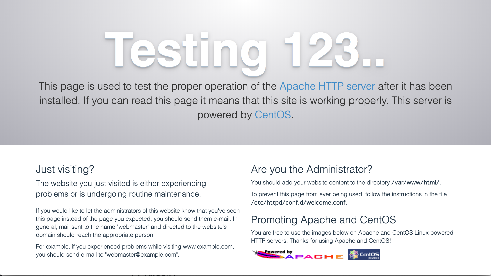
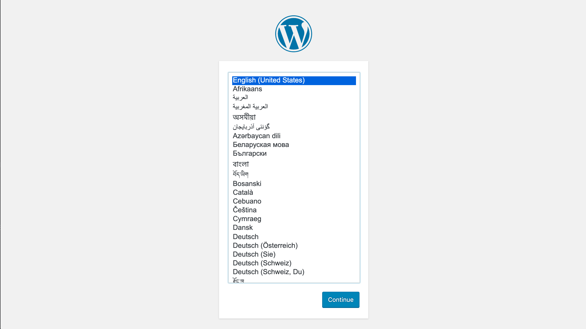
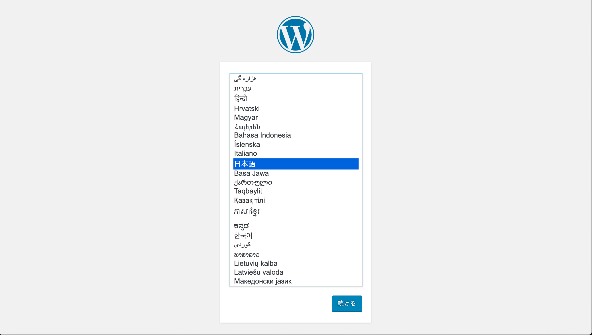
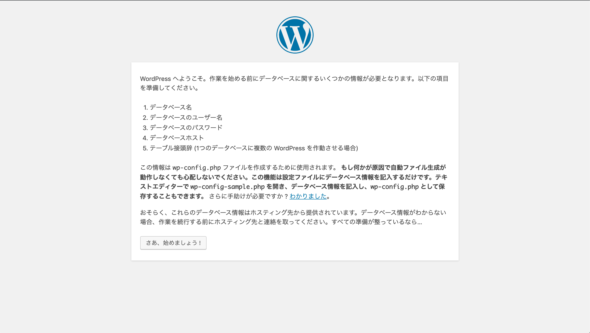
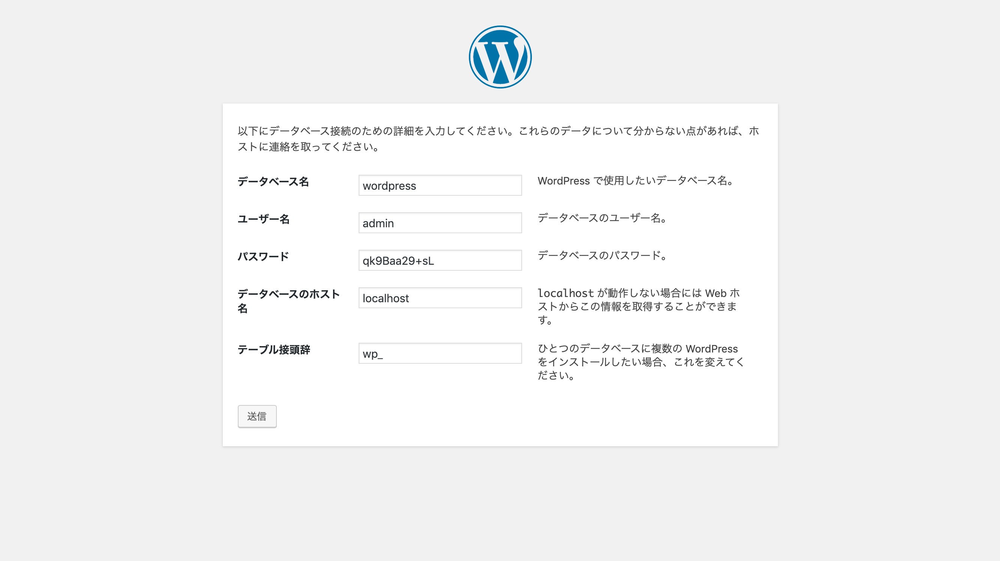
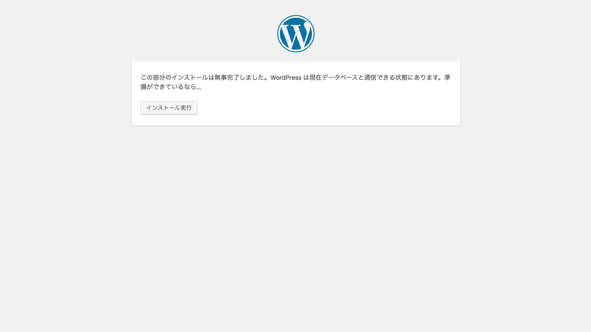
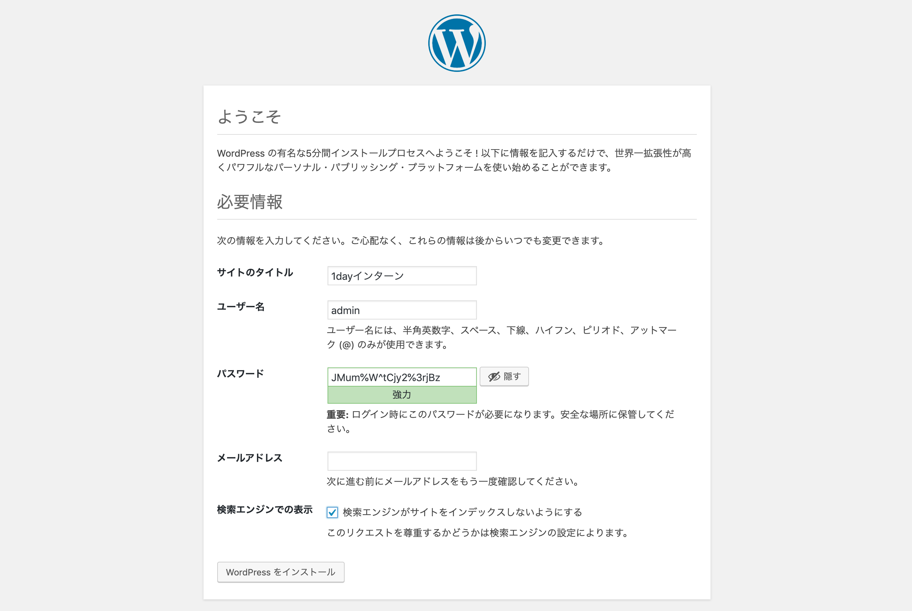
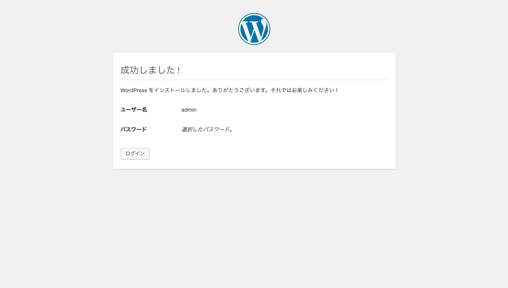
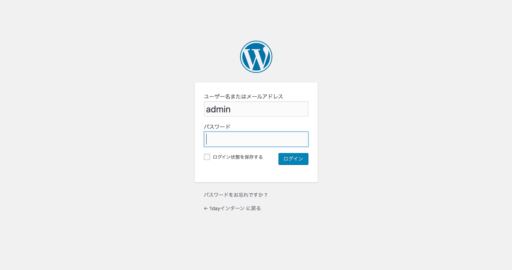
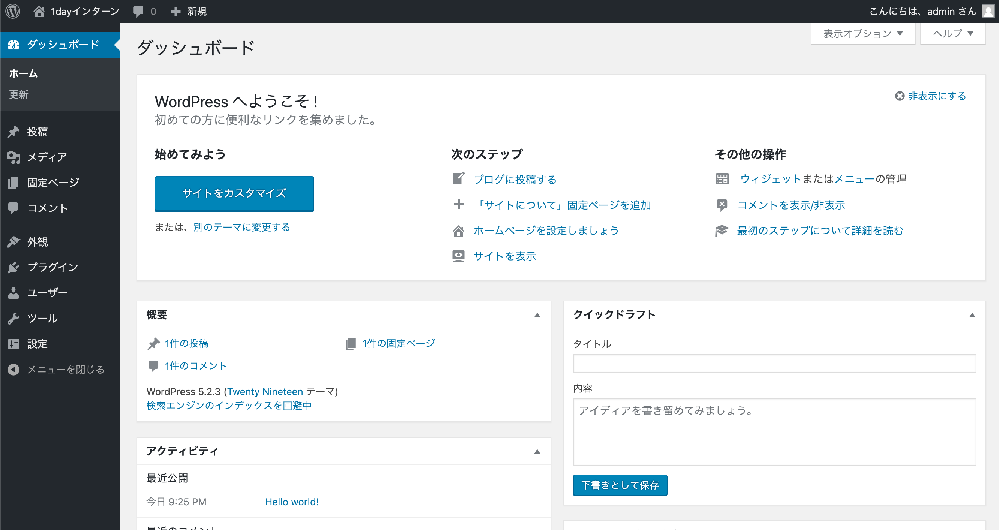

# Step2
このStepではStep1で作成した仮装環境をLAMP環境にカスタマイズしていきます。

## LAMP環境の構築
Step1で構築した環境にapache、php、mysqlをインストールしLAMP環境を構築します

## yum repo
これから各種ミドルウェア(apache、MySQL）やPHPをインストールする際に利用するリポジトリの設定を行う

**`/etc/yum.repos.d/`ディレクトリと内容について簡単に確認**

```
# ll /etc/yum.repos.d/
total 32
-rw-r--r--. 1 root root 1664 Nov 23  2018 CentOS-Base.repo
-rw-r--r--. 1 root root 1309 Nov 23  2018 CentOS-CR.repo
-rw-r--r--. 1 root root  649 Nov 23  2018 CentOS-Debuginfo.repo
-rw-r--r--. 1 root root  314 Nov 23  2018 CentOS-fasttrack.repo
-rw-r--r--. 1 root root  630 Nov 23  2018 CentOS-Media.repo
-rw-r--r--. 1 root root 1331 Nov 23  2018 CentOS-Sources.repo
-rw-r--r--. 1 root root 5701 Nov 23  2018 CentOS-Vault.repo

# cat /etc/yum.repos.d/CentOS-Base.repo

# CentOS-Base.repo
#
# The mirror system uses the connecting IP address of the client and the
# update status of each mirror to pick mirrors that are updated to and
# geographically close to the client.  You should use this for CentOS updates
# unless you are manually picking other mirrors.
#
# If the mirrorlist= does not work for you, as a fall back you can try the
# remarked out baseurl= line instead.
#
#

[base]
name=CentOS-$releasever - Base
mirrorlist=http://mirrorlist.centos.org/?release=$releasever&arch=$basearch&repo=os&infra=$infra
#baseurl=http://mirror.centos.org/centos/$releasever/os/$basearch/
gpgcheck=1
gpgkey=file:///etc/pki/rpm-gpg/RPM-GPG-KEY-CentOS-7

#released updates
[updates]
name=CentOS-$releasever - Updates
mirrorlist=http://mirrorlist.centos.org/?release=$releasever&arch=$basearch&repo=updates&infra=$infra
#baseurl=http://mirror.centos.org/centos/$releasever/updates/$basearch/
gpgcheck=1
gpgkey=file:///etc/pki/rpm-gpg/RPM-GPG-KEY-CentOS-7

#additional packages that may be useful
[extras]
name=CentOS-$releasever - Extras
mirrorlist=http://mirrorlist.centos.org/?release=$releasever&arch=$basearch&repo=extras&infra=$infra
#baseurl=http://mirror.centos.org/centos/$releasever/extras/$basearch/
gpgcheck=1
gpgkey=file:///etc/pki/rpm-gpg/RPM-GPG-KEY-CentOS-7

#additional packages that extend functionality of existing packages
[centosplus]
name=CentOS-$releasever - Plus
mirrorlist=http://mirrorlist.centos.org/?release=$releasever&arch=$basearch&repo=centosplus&infra=$infra
#baseurl=http://mirror.centos.org/centos/$releasever/centosplus/$basearch/
gpgcheck=1
enabled=0
gpgkey=file:///etc/pki/rpm-gpg/RPM-GPG-KEY-CentOS-7
```

### epel
epelのインストール(注 `yum -y update`は数分ほど掛かる)

```
# yum -y install epel-release
# yum -y update
```

### remi
remiのインストール

```
# yum -y install http://rpms.famillecollet.com/enterprise/remi-release-7.rpm
# yum -y update
```

**`/etc/yum.repos.d/`ディレクトリと内容について簡単に確認**

```
# ll /etc/yum.repos.d/
total 96
-rw-r--r--. 1 root root 1664 Nov 23  2018 CentOS-Base.repo
-rw-r--r--. 1 root root 1309 Nov 23  2018 CentOS-CR.repo
-rw-r--r--. 1 root root  649 Nov 23  2018 CentOS-Debuginfo.repo
-rw-r--r--. 1 root root  314 Nov 23  2018 CentOS-fasttrack.repo
-rw-r--r--. 1 root root  630 Nov 23  2018 CentOS-Media.repo
-rw-r--r--. 1 root root 1331 Nov 23  2018 CentOS-Sources.repo
-rw-r--r--. 1 root root 5701 Nov 23  2018 CentOS-Vault.repo
-rw-r--r--. 1 root root  951 Oct  2  2017 epel.repo
-rw-r--r--. 1 root root 1050 Oct  2  2017 epel-testing.repo
-rw-r--r--. 1 root root  446 Mar  8 07:34 remi-glpi91.repo
-rw-r--r--. 1 root root  446 Mar  8 07:34 remi-glpi92.repo
-rw-r--r--. 1 root root  446 Mar  8 07:34 remi-glpi93.repo
-rw-r--r--. 1 root root  446 Mar  8 07:34 remi-glpi94.repo
-rw-r--r--. 1 root root  855 Mar  8 07:34 remi-modular.repo
-rw-r--r--. 1 root root  456 Mar  8 07:34 remi-php54.repo
-rw-r--r--. 1 root root 1314 Mar  8 07:34 remi-php70.repo
-rw-r--r--. 1 root root 1314 Mar  8 07:34 remi-php71.repo
-rw-r--r--. 1 root root 1314 Mar  8 07:34 remi-php72.repo
-rw-r--r--. 1 root root 1314 Mar  8 07:34 remi-php73.repo
-rw-r--r--. 1 root root 2605 Mar  8 07:34 remi.repo
-rw-r--r--. 1 root root  750 Mar  8 07:34 remi-safe.repo
```

yumコマンドでも確認

```
# yum repolist
Loaded plugins: fastestmirror
Loading mirror speeds from cached hostfile
 * base: ftp.yz.yamagata-u.ac.jp
 * epel: ftp.yz.yamagata-u.ac.jp
 * extras: ftp.yz.yamagata-u.ac.jp
 * remi-safe: mirror.innosol.asia
 * updates: ftp.yz.yamagata-u.ac.jp
repo id                                         repo name                                                                status
!base/7/x86_64                                  CentOS-7 - Base                                                          10,019
!epel/x86_64                                    Extra Packages for Enterprise Linux 7 - x86_64                           13,378
!extras/7/x86_64                                CentOS-7 - Extras                                                           435
!mysql-connectors-community/x86_64              MySQL Connectors Community                                                  118
!mysql-tools-community/x86_64                   MySQL Tools Community                                                        95
!mysql80-community/x86_64                       MySQL 8.0 Community Server                                                  129
!remi-safe                                      Safe Remi's RPM repository for Enterprise Linux 7 - x86_64                3,600
!updates/7/x86_64                               CentOS-7 - Updates                                                        2,500
repolist: 30,274
```

### Question
yum、RPMについて調べてみましょう

## PHP7、apache(httpd)
PHP7、apache(httpd)のインストールを行う

```
# yum -y install --enablerepo=remi,remi-php73 php php-devel php-mbstring php-pdo php-gd php-xml php-mcrypt php-mysql
```

PHPのバージョンを確認

```
# php -v
```

apache(httpd)がインストールされていることを確認

```
# yum list installed | grep httpd
```

apache(httpd)の起動、自動起動の設定を行う

起動
```
# systemctl start httpd.service
```

自動起動設定
```
# systemctl enable httpd.service
```

確認(enableであること)
```
# systemctl is-enabled httpd.service
```

確認(runningであること)

```
# systemctl status httpd.service
```

localhostに対しhttpリクエストを投げWebサーバ(httpd)が動作していることを確認

```
# curl localhost
```

**ブラウザでも同様に192.168.56.50で確認する**



### lsof
apache(httpd)がPORT80番をLISTENしているか確認するため`lsof`をインストール

```
# yum -y install lsof
```

確認

```
# lsof -i:80
COMMAND  PID   USER   FD   TYPE DEVICE SIZE/OFF NODE NAME
httpd    734   root    4u  IPv6  16183      0t0  TCP *:http (LISTEN)
httpd    769 apache    4u  IPv6  16183      0t0  TCP *:http (LISTEN)
httpd    770 apache    4u  IPv6  16183      0t0  TCP *:http (LISTEN)
httpd    771 apache    4u  IPv6  16183      0t0  TCP *:http (LISTEN)
httpd    772 apache    4u  IPv6  16183      0t0  TCP *:http (LISTEN)
httpd    773 apache    4u  IPv6  16183      0t0  TCP *:http (LISTEN)
httpd   3007 apache    4u  IPv6  16183      0t0  TCP *:http (LISTEN)
```

### Question
`/var/www/html/`配下に以下のindex.phpを配置しブラウザ、CLI`curl localhost`で確認してみましょう

```
<?php
echo "hello PHP";
```

### Question
PHPのBuiltinWebServerの機能を使いPORT 8888番でindex.phpを表示してみましょう(CTL + cで停止)

**注 SELinuxが有効なため現時点では別ターミナルから`curl localhost`のみ表示できます**

```
# cd /var/www/html
# php -S localhost:8888
```

## MySQL
MySQLのインストールを行う

### mariadb削除
標準でインストールされているmariadbを削除する

確認
```
# rpm -qa | grep mariadb
mariadb-libs-5.5.60-1.el7_5.x86_64
```

存在する場合削除
```
# yum -y remove mariadb-libs
```

ディレクトリも削除
```
# rm -rf /var/lib/mysql/
```

### MySQL yumrepo
yumrepoをインストールし`enabled`を確認

```
# rpm -ivh https://dev.mysql.com/get/mysql80-community-release-el7-3.noarch.rpm
```

確認

```
# yum repolist all | grep mysql
mysql-cluster-7.5-community/x86_64 MySQL Cluster 7.5 Community   disabled
mysql-cluster-7.5-community-source MySQL Cluster 7.5 Community - disabled
mysql-cluster-7.6-community/x86_64 MySQL Cluster 7.6 Community   disabled
mysql-cluster-7.6-community-source MySQL Cluster 7.6 Community - disabled
mysql-cluster-8.0-community/x86_64 MySQL Cluster 8.0 Community   disabled
mysql-cluster-8.0-community-source MySQL Cluster 8.0 Community - disabled
mysql-connectors-community/x86_64  MySQL Connectors Community    enabled:    118
mysql-connectors-community-source  MySQL Connectors Community -  disabled
mysql-tools-community/x86_64       MySQL Tools Community         enabled:     95
mysql-tools-community-source       MySQL Tools Community - Sourc disabled
mysql-tools-preview/x86_64         MySQL Tools Preview           disabled
mysql-tools-preview-source         MySQL Tools Preview - Source  disabled
mysql55-community/x86_64           MySQL 5.5 Community Server    disabled
mysql55-community-source           MySQL 5.5 Community Server -  disabled
mysql56-community/x86_64           MySQL 5.6 Community Server    disabled
mysql56-community-source           MySQL 5.6 Community Server -  disabled
mysql57-community/x86_64           MySQL 5.7 Community Server    disabled
mysql57-community-source           MySQL 5.7 Community Server -  disabled
mysql80-community/x86_64           MySQL 8.0 Community Server    enabled:    129
mysql80-community-source           MySQL 8.0 Community Server -  disabled
```

MySQL8.0をインストール(450M以上あるので注意)

```
# yum -y install mysql-community-server
```

MySQLの起動、自動起動を設定

```
# systemctl start mysqld.service
# systemctl enable mysqld.service
```

確認(runningであること)

```
# systemctl status mysqld.service
```

MySQLがPORT3306番をLISTENしているか確認

```
# lsof -i:3306
COMMAND   PID  USER   FD   TYPE DEVICE SIZE/OFF NODE NAME
mysqld  31699 mysql   30u  IPv6  65873      0t0  TCP *:mysql (LISTEN)
```
MySQLのrootパスワードをログから確認`A temporary password is generated for root@localhost:`の右を確認

```
# cat /var/log/mysqld.log
# grep password /var/log/mysqld.log
```

`mysql_secure_installation`を実行

```
# mysql_secure_installation
```

確認したパスワードを入力

```
Enter password for user root: 
```

i1db+abd8kD

```
New password: 
```

i1db+abd8kD

```
Re-enter new password: 
```

y

```
Change the password for root ? ((Press y|Y for Yes, any other key for No) : 
```

i1db+abd8kD

```
New password:
```

i1db+abd8kD

```
Re-enter new password:
```

y

```
Do you wish to continue with the password provided?(Press y|Y for Yes, any other key for No) :
```

y

```
Remove anonymous users? (Press y|Y for Yes, any other key for No) :
```

y

```
Disallow root login remotely? (Press y|Y for Yes, any other key for No) : 
```

y

```
Remove test database and access to it? (Press y|Y for Yes, any other key for No) : 
```

y

```
Reload privilege tables now? (Press y|Y for Yes, any other key for No) : 
```

MySQLクライアントからログイン。パスワードは`mysql_secure_installation`で設定したものを入力

パスワード：i1db+abd8kD

```
# mysql -u root -p
Enter password:

mysql> show databases;
+--------------------+
| Database           |
+--------------------+
| information_schema |
| mysql              |
| performance_schema |
| sys                |
+--------------------+
4 rows in set (0.00 sec)

mysql>
```

DB`wordpress`の作成

```
mysql> create database wordpress;
Query OK, 1 row affected (0.07 sec)
```

作成したDBの確認

```
mysql> show databases;
+--------------------+
| Database           |
+--------------------+
| information_schema |
| mysql              |
| performance_schema |
| sys                |
| wordpress          |
+--------------------+
5 rows in set (0.04 sec)
```

DDLの確認

```
mysql> show create database wordpress;
+-----------+-------------------------------------------------------------------------------------------------------------------------------------+
| Database  | Create Database                                                                                                                     |
+-----------+-------------------------------------------------------------------------------------------------------------------------------------+
| wordpress | CREATE DATABASE `wordpress` /*!40100 DEFAULT CHARACTER SET utf8mb4 COLLATE utf8mb4_0900_ai_ci */ /*!80016 DEFAULT ENCRYPTION='N' */ |
+-----------+-------------------------------------------------------------------------------------------------------------------------------------+
1 row in set (0.00 sec)
```

アプリケーションユーザの作成

```
mysql> create user 'admin'@'localhost'identified by 'qk9Baa29+sL';

mysql> grant all on *.* to 'admin'@'localhost';

mysql> alter user 'admin'@'localhost' identified with mysql_native_password by 'qk9Baa29+sL';

mysql> exit
```

## サンプルアプリのデプロイ

`wget`コマンドのインストール

```
# yum -y install wget
```

今回アプリケーションをデプロイするディレクトリへ遷移
```
# cd /var/www/html
```

Wordpressを取得し`tar`で展開

```
# wget http://wordpress.org/latest.tar.gz
# tar -xzvf latest.tar.gz
```

ファイル所有者の変更

```
# chown apache:apache -R wordpress
```

SELinuxの設定

```
# chcon -R -t httpd_sys_content_t /var/www/html/wordpress
# chcon -R -t httpd_sys_rw_content_t /var/www/html/wordpress
```

apache(httpd)の設定変更と再起動

```
# vi /etc/httpd/conf/httpd.conf
- DocumentRoot "/var/www/html"
+ DocumentRoot "/var/www/html/wordpress"
- <Directory "/var/www/html">
+<Directory "/var/www/html/wordpress">
```

apache(httpd)の再起動

```
# systemctl restart httpd.service
```

**ブラウザで192.168.56.50を表示。Wordpressの設定画面が表示されれば成功**



## Wordpressの設定
日本語を選択し続けるを押下



さあ、始めましょうを押下



ユーザ：admin、パスワード：qk9Baa29+sL



インストール実行を押下



サイトのタイトル「1dayインターン」、ユーザ名：admin、パスワードはテキスト保存しましょう、メールアドレスは任意で設定、検索エンジンでの表示はチェックしWordPressをインストールを押下



ログインを押下



ユーザ名：admin、パスワードはテキスト保存したパスワードを入力しログイン



管理画面が表示されること



これでStep2は完了です

